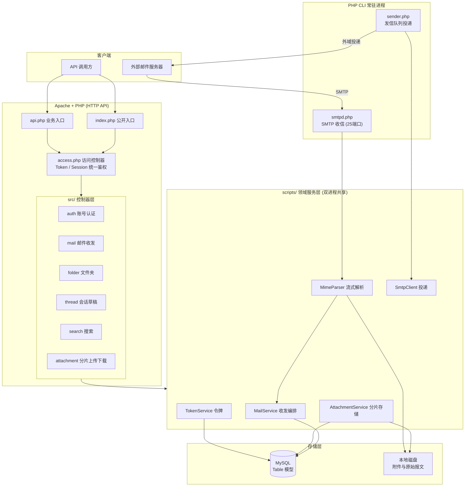

## 用户需求

基于 PHP + Apache + MySQL 技术栈，使用 `framework/php.NET` 框架，编写一个**纯 API 形式的邮件服务器**（不编写任何 HTML 前端页面）。需要参照框架自带的 `framework/php.NET/docs` 帮助文档与 `framework/php.NET/tutorials` 网站 Demo 示例代码的写法与目录约定进行开发。核心要求是能够处理邮件的接收与发送，并支持大型文件附件。

## 产品概述

一套完整的自建邮件服务系统，由两部分组成：

1. **HTTP API 服务**（运行于 Apache）：对外提供 JSON 接口，覆盖账号管理、邮件收发、文件夹管理、会话与草稿、全文搜索、大附件分片上传与断点续传下载。
2. **SMTP 收信守护进程**（PHP 命令行常驻进程，监听 25 端口）：接收来自互联网的真实邮件，解析 MIME 内容与附件后落库归档；发信侧通过 SMTP 客户端向目标域名投递。

所有接口统一返回 JSON 消息协议（成功 `code=0`，失败携带业务错误码与描述文本），供任意客户端（网页、桌面、移动端、第三方系统）调用。

## 核心功能

### 账号与认证

- 用户注册、登录、登出、修改密码、查询个人资料
- 邮箱账号分配（用户名 + 服务域名构成完整邮件地址），支持账号启用/停用与配额上限
- 双认证模式并存：浏览器端沿用框架 Session 登录态；API 客户端使用 Token（登录换取，请求头携带），支持 Token 过期与主动吊销

### 邮件发送

- 撰写并发送邮件：收件人（To/Cc/Bcc 多地址）、主题、纯文本与 HTML 正文、关联附件
- 本域内投递直接入库到对方收件箱；外域投递经由发信队列异步向目标邮件服务器投递
- 发信失败自动重试并记录投递状态与失败原因，支持查询单封邮件的投递结果

### 邮件接收

- SMTP 服务端完整实现会话流程（问候、身份标识、发件人与收件人指令、数据传输、退出），校验收件人是否存在及邮箱容量
- 解析原始邮件报文：信头解码（主题、发件人、日期等多种编码格式）、多层嵌套正文结构、内嵌图片与附件提取
- 超大来信采用流式落盘处理，避免整封邮件读入内存
- 自动归入收件人的收件箱，并按引用关系聚合到对应会话

### 文件夹与邮件管理

- 系统文件夹：收件箱、已发送、草稿箱、垃圾邮件、回收站；支持用户自建文件夹
- 邮件在文件夹间移动、标记已读/未读、加星标、批量操作、彻底删除
- 分页列表返回邮件摘要（发件人、主题、摘要片段、时间、附件标识、已读与星标状态）

### 会话与草稿

- 按邮件引用关系聚合为会话线程，返回会话内邮件的时间序列表与参与者
- 草稿保存、覆盖更新、读取再编辑，草稿可直接转为正式发送

### 全文搜索

- 按主题、发件人、收件人、正文关键词组合检索，支持限定文件夹、时间范围、是否含附件等过滤条件
- 结果分页返回并附带命中总数

### 大附件支持

- 分片上传：初始化上传会话获取标识，逐片上传并记录已完成分片，查询上传进度，全部完成后合并落盘
- 断点续传：中断后可查询已上传分片并从断点继续
- 秒传：相同内容的文件通过校验值识别，直接复用已有存储
- 分片下载：支持范围请求，可断点续传下载，大文件流式输出不占用大量内存
- 附件元数据（原始文件名、类型、大小、存储路径、校验值）入库，二进制内容存放于本地磁盘按目录分片存储

## 一、技术栈选型

| 层次 | 选型 | 依据 |
| --- | --- | --- |
| 运行环境 | PHP + Apache（mod_rewrite）+ MySQL | 用户明确指定 |
| 应用框架 | `framework/php.NET`（只读引用，不修改框架任何文件） | 用户明确指定 |
| 路由与控制器 | 框架 `dotnet::HandleRequest($app, $accessController)` + 「注释即配置」元数据标签 | 框架核心机制，tutorials Demo 已验证 |
| 数据访问 | 框架 `Table` 链式模型（`MVC.model`，`dotnet::AutoLoad()` 自动加载） | 统一走框架，禁止绕过写裸 mysqli |
| 请求/响应 | `WebRequest` / `WebResponse`（`MVC.request`，自动加载） | 类型化取值天然防注入 |
| 消息协议 | `controller::success($info)` / `controller::error($msg, $code)` | 框架统一 JSON 协议 |
| SMTP 服务端 | PHP CLI 常驻进程 + 原生 `ext-sockets` | 框架 `php/websocket/SocketServer.php` 已实证环境具备 ext-sockets |
| SMTP 客户端 | 自研，基于 `stream_socket_client` + STARTTLS | 框架内无任何 SMTP/IMAP/mail() 实现，必须自研 |
| MIME 编解码 | 自研解析器，辅以 `Microsoft.VisualBasic.Net.MimeTypes` | 框架仅有 MIME 类型映射表，无报文解析能力 |
| 附件存储 | 本地磁盘两级哈希目录 + 数据库存元数据 | 用户明确选择「分片上传 + 本地磁盘」 |
| 日志 | `Microsoft.VisualBasic.ApplicationServices.Debugger.Logging.LogFile` + `console::log` | 复用框架既有日志设施 |


**关键取舍**：MIME 解析与 SMTP 协议为完全自研（已核实框架 `Framework/` 内无相关实现）。不引入 Composer 依赖（PHPMailer 等），保持与框架 `imports()` 加载体系一致，避免自动加载机制冲突。

## 二、实现方案

### 2.1 总体策略

采用**「HTTP API 进程」与「SMTP 守护进程」双进程 + 共享领域层**的架构。两者复用同一套 `scripts/` 领域服务与 `Table` 数据模型，仅入口与 I/O 方式不同：Web 侧经 Apache 由 `index.php` 引导；SMTP 侧由 `daemon/smtpd.php` 以 CLI 常驻。框架 `package.php` 已内建 `IS_CLI` 常量并在 CLI 下将 `SITE_PATH` 回退为 `getcwd()`，因此同一套 bootstrap 逻辑可安全地被两种入口复用——这是本方案能够零成本共享领域层的前提。

### 2.2 双入口设计（关键决策）

框架的 `MVC_VIEW_ROOT` 支持「按入口脚本名分组」，且 tutorials 的 `index.php` 注释明确指出可「将来增加 api.php 等第二个入口」。据此拆分为两个 Web 入口：

- `index.php` —— 公开接口入口（注册、登录、SMTP 探活）
- `api.php` —— 业务接口入口（其余全部需鉴权接口）

拆分收益：访问控制器可依据入口名快速判定是否强制鉴权，避免在每个 action 内重复判断；同时便于 Apache 层对两者施加不同的上传体积与超时策略（附件分片走 `api.php`）。

### 2.3 双认证模式统一化（关键决策）

用户要求 Session 与 Token 并存。方案是在访问控制器 `accessControl()` 中做**统一身份解析**，按优先级尝试 Token（`Authorization: Bearer` 头或 `token` 参数）→ Session，任一成功即在请求上下文中固化当前用户，后续所有领域服务只依赖该上下文，**不再关心认证来源**。

- 判定逻辑：`$this->AccessByEveryOne()` 为真（即标注 `@access *`）时直接放行；否则要求解析出有效用户，失败返回 403
- Token 采用「随机串 + 服务端存储」而非自包含签名令牌，理由：支持主动吊销与「登出即失效」，且避免在 PHP 侧手写 JWT 签名校验带来的实现风险
- 密码存储使用 `password_hash()` / `password_verify()`（PHP 原生 bcrypt），Token 明文不落库，仅存其哈希值，防止库泄露后被直接冒用

### 2.4 SMTP 收信守护进程（关键决策与风险控制）

以**非阻塞 socket + `socket_select()` 单进程多路复用**实现，而非「每连接 fork 一个子进程」。理由：`pcntl` 扩展在 Windows 下不可用，而工作区为 Windows 环境；多路复用方案跨平台且无进程开销。参考框架 `SocketServer.php` 的 `socket_create` / `socket_bind` / `socket_listen` / `socket_accept` 与 `set_time_limit(0)`、`ob_implicit_flush()` 写法。

每个连接维护一个独立的**协议状态机**（`INIT → GREETED → MAIL → RCPT → DATA → QUIT`），状态与缓冲区隔离在连接对象内，互不干扰。

**内存安全（核心风险点）**：DATA 阶段绝不将整封邮件累积在内存字符串中。收到的数据块**边收边追加写入临时文件**，仅在缓冲区尾部保留少量字节用于跨块检测结束标记（`\r\n.\r\n`）与执行透明填充还原（行首连续点号还原）。由此单连接内存占用恒定在 KB 级，与邮件体积无关，可安全接收数百 MB 的带附件来信。

**防滥用措施**：连接数上限、单连接空闲超时、单封邮件体积上限（超限即以 552 拒绝并停止写盘）、单连接收件人数量上限、非法指令连续出错即断开。所有拒绝均返回符合规范的响应码。

### 2.5 MIME 解析（流式，避免内存峰值）

解析器对落盘的原始报文**基于文件句柄逐行读取**，而非 `file_get_contents` 全量载入：

1. 读取信头直至空行，处理折行续行，解码编码字（Base64 与 Quoted-Printable 两种形式、多种字符集），统一转换为 UTF-8
2. 依据 `Content-Type` 的 boundary 递归切分多层嵌套结构，**只记录每个分段在原始文件中的字节偏移与长度**，不复制内容
3. 正文分段按偏移读取并解码；附件分段以**分块流式解码直接写入目标存储文件**（Base64 解码按 4 字节对齐分块处理），全程内存占用恒定
4. 内嵌图片依据 `Content-ID` 单独标记，与普通附件区分

**复杂度**：单封邮件解析为 O(n)（n 为报文字节数），内存 O(1)。

### 2.6 大附件分片上传（关键决策）

采用「初始化 → 分片上传 → 合并」三段式协议：

- **初始化**：客户端提交文件名、总大小、分片大小与整文件校验值，服务端建立上传会话并返回标识；若校验值命中已有附件，直接返回「秒传」标记，跳过全部传输
- **分片上传**：每片以独立请求上传，服务端将分片写入会话临时目录并登记序号与校验值；分片幂等，重复上传同一序号覆盖处理
- **进度查询**：返回已完成分片序号集合，客户端据此实现断点续传
- **合并**：全部分片齐备后按序流式拼接到最终存储路径（两级哈希目录分散，规避单目录文件数过多导致的文件系统性能衰减），校验整文件哈希，成功后清理临时目录并落库元数据

**为何不用单次 multipart**：单次上传受 `upload_max_filesize`、`post_max_size`、`max_execution_time` 三重限制，且中断后必须整体重传。分片方案将风险切分到片级，天然支持续传，是大文件场景的成熟实践。

**并发安全**：分片写入使用「先写临时文件再原子重命名」，避免并发写入产生半截文件；合并操作加文件锁，防止重复触发。

### 2.7 大附件下载

不使用框架 `Utils::PushDownload()`，原因经核实：其内部先执行 `ob_end_clean()` 后整体推送，**不支持 Range 范围请求**（虽发送了 `Accept-Ranges` 头但未解析请求侧 `Range`），无法满足断点续传要求。

自研流式下载：解析 `Range` 请求头 → 返回 206 与 `Content-Range` → `fseek` 定位后按固定大小缓冲块循环 `fread` + `flush` 输出。输出前关闭输出缓冲与压缩，禁用脚本超时。内存占用恒定为单个缓冲块大小。

### 2.8 发信队列与投递

发信接口只负责**入库并置为待发送**后立即返回，不在 HTTP 请求内做网络投递（避免请求长时间阻塞与超时）。实际投递由 `daemon/sender.php` 常驻进程轮询队列执行：

- 本域收件人：直接在数据库内投递到对方收件箱，无需走网络
- 外域收件人：查询目标域 MX 记录（`getmxrr()`，失败则回退到域名本身 A 记录），建立 SMTP 连接，尝试 STARTTLS 升级加密，按规范完成会话，附件以 Base64 分块编码流式写入 socket
- 失败按**指数退避**重试（间隔递增），达到最大重试次数后置为最终失败并记录完整错误链
- 单封邮件多收件人时按域名分组，同域收件人合并为一次连接投递，减少连接数

### 2.9 全文搜索与分页

- 搜索基于 `Table` 的 `where` + `like()` 表达式助手构建，**严禁字符串拼接 SQL**；多字段或关系利用框架「多字段组合键」语法（`"subject|body_text"` 形式）
- 邮件正文单独抽取纯文本摘要列并建立索引，避免对大文本列做全表扫描
- 分页统一走「条件 count + limit 偏移」模式（与 tutorials 的 `find_page()` 写法一致），返回 `page` / `total` / `total_page` / `current_page` 结构
- 关键查询字段（用户、文件夹、时间、会话）建立联合索引；列表查询只 `select` 摘要所需列，不取正文大字段，规避不必要的 I/O

## 三、实现要点（防回归）

- **元数据标签生效前提**：`dotnet::HandleRequest()` **必须传入访问控制器实例**，否则框架退化为直接反射调用，`@access`/`@require`/`@method`/`@rate` 全部失效。这是框架文档反复强调的头号陷阱。
- **`@method` 默认只接受 GET**：所有写操作接口必须显式声明 `@method POST`，否则返回 405。
- **`save()` 的 `$limit1` 默认为 `true`**：批量更新（如批量标记已读、批量移动文件夹）**必须显式传入 `false`**，否则只会更新一行，这是极易踩中的静默错误。
- **`Table` 链式调用返回新实例**：原对象不被修改，可安全复用基础对象构建多个查询（分页中的 count 与 select 即依赖此特性）。
- **`add()` 返回值**：有自增主键时返回新行 id，无自增返回 `true`，失败返回 `false`。判断失败必须用 `=== false`，不可用真值判断（id 可能为合法值）。
- **`find()` / `findfield()` 未找到返回 `false`**，`findfield()` 字段名区分大小写。
- **禁止使用 `~` 前缀原生表达式**承载任何用户输入，该前缀内容原样拼接不转义，存在注入风险；仅在计数器自增等固定语句中使用。
- **`APP_DEBUG` 必须在 `include package.php` 之前定义**，生产环境置为 `false`，否则泄露服务器内部信息并拖慢性能。
- **CLI 守护进程**：必须 `set_time_limit(0)`；避免在长生命周期进程内无限累积数组导致内存泄漏；数据库连接需具备断线重连能力（长时间空闲会被 MySQL 主动断开）。
- **日志规范**：复用框架 `LogFile`；严禁记录密码、Token 明文、邮件正文全文；SMTP 会话日志按连接采样记录，避免高并发下日志爆炸；错误日志需包含足够定位信息但不倾倒大体积报文。
- **`REWRITE_ENGINE` 配置与 `.htaccess` 必须成对开启**，否则框架会给出警告或路由异常。
- **附件目录必须置于 Web 根目录之外**（或用 `.htaccess` 拒绝直接访问），所有下载必须经 API 鉴权后由 PHP 流式输出，杜绝越权直取。
- **路径安全**：涉及用户提交的文件名一律使用 `WebRequest::getPath()`（内置目录穿越防护）并重新生成服务端存储名，绝不用原始文件名直接落盘。
- **不修改 `framework/php.NET/` 内任何文件**。

## 四、架构设计



### 请求链路

**HTTP**：Apache → `.htaccess` 重写 → `index.php`/`api.php` → `bootstrap.php`（定义常量 → `package.php` → 加载站点脚本 → `dotnet::AutoLoad(config)`）→ `dotnet::HandleRequest(new App(), new accessController())` → 标签校验（IP → 方法 → 必需参数）→ `accessControl()` 鉴权 → `Restrictions()` 限流 → `sendContentType()` → 控制器方法 → 领域服务 → `Table` → `controller::success/error`

**SMTP 收信**：外部服务器 → `smtpd.php` accept → 协议状态机 → DATA 流式落盘 → `MimeParser` 流式解析 → 附件落盘 + 元数据入库 → 投递到收件箱 → 会话聚合

**发信**：API 入队 → `sender.php` 轮询 → 本域直投 / 外域 MX 查询 → `SmtpClient` STARTTLS 投递 → 更新状态或退避重试

## 五、目录结构

新建项目根目录 `d:/mail/mailserver/`，与 `framework/` 平级，**不触碰框架任何文件**。

```
d:/mail/
├── framework/php.NET/          # [只读] 框架本体，禁止修改
└── mailserver/                 # [NEW] 邮件服务器项目根
    ├── index.php               # [NEW] 公开入口。仅 require bootstrap.php；承载注册/登录等免鉴权接口
    ├── api.php                 # [NEW] 业务入口。仅 require bootstrap.php；承载全部需鉴权接口，便于 Apache 层单独放宽上传限制
    ├── bootstrap.php           # [NEW] 引导脚本。定义 APP_PATH/PHP_DOTNET_HOME/APP_DEBUG(false)/MAINTENANCE_MODE、启动 session、
    │                           #       include package.php、加载 .etc 与 src 与 scripts、dotnet::AutoLoad(config)、
    │                           #       dotnet::HandleRequest(new App(), new accessController())。
    │                           #       必须在 include package.php 前定义 APP_DEBUG。需按入口脚本名选择要实例化的 App 类
    ├── .htaccess               # [NEW] RewriteEngine On（与配置 REWRITE_ENGINE 成对）；友好 URL 映射到入口；
    │                           #       拒绝访问 .etc/ scripts/ storage/ logs/ daemon/；放宽附件接口的上传体积与超时
    ├── .etc/
    │   ├── config.ini.php      # [NEW] 注册表配置。return 数组：DB_* 连接参数、APP_NAME/APP_VERSION、
    │   │                       #       RFC7231 错误页目录、CACHE=FALSE、DEFAULT_AUTH_KEY、REWRITE_ENGINE=TRUE、
    │   │                       #       以及邮件服务自定义项：服务域名、SMTP 监听地址与端口、附件存储根路径、
    │   │                       #       单邮件与单附件体积上限、分片大小、Token 有效期、投递重试次数与退避间隔
    │   ├── access.php          # [NEW] 访问控制器 accessController extends controller。imports("MVC.controller")。
    │   │                       #       实现 accessControl()：@access * 直接放行；否则按 Token → Session 优先级解析身份，
    │   │                       #       解析成功固化当前用户上下文并校验角色，失败返回 false。
    │   │                       #       实现 Restrictions()：基于 @rate 与 RestrictionMySQL 做限流计数。
    │   │                       #       实现 Redirect($code) 与 handleNotFound()，统一以 JSON 返回错误而非 HTML 错误页
    │   └── registry.php        # [NEW] 站点公共函数：current_user()、require_login()、json 参数体解析、
    │                           #       统一响应包装、UUID 生成、邮件地址合法性校验与域名判定
    ├── src/                    # 控制器层：每个类的 public 方法即一个接口
    │   ├── index.php           # [NEW] class App（公开入口用）。register 注册、login 登录换取 Token、
    │   │                       #       logout 登出吊销、health SMTP 与队列探活。全部标注 @uses api @access *，
    │   │                       #       写操作标注 @method POST，登录接口加 @rate 防暴力破解
    │   ├── mail.php            # [NEW] class MailApp。send 发送、get 详情、list 列表、delete 删除、
    │   │                       #       resend 重投、status 投递状态查询。send 需校验收件人格式与附件归属
    │   ├── folder.php          # [NEW] class FolderApp。list 文件夹列表与未读数、create/rename/remove 自建文件夹、
    │   │                       #       move 移动邮件、mark 标记已读未读、star 星标、batch 批量操作。
    │   │                       #       批量操作调用 save() 时必须显式传 $limit1=false
    │   ├── thread.php          # [NEW] class ThreadApp。list 会话列表、detail 会话内邮件时间序、
    │   │                       #       draft_save 草稿保存与覆盖、draft_get 草稿读取、draft_send 草稿转发送
    │   ├── search.php          # [NEW] class SearchApp。query 多条件全文检索。使用 like() 表达式助手与
    │   │                       #       多字段组合键构建条件，严禁字符串拼接 SQL；分页返回摘要列表与命中总数
    │   └── attachment.php      # [NEW] class AttachmentApp。init 初始化上传会话（含秒传判定）、
    │                           #       chunk 分片上传、progress 进度查询、complete 合并落盘、
    │                           #       download 流式下载（解析 Range 返回 206，禁用输出缓冲与超时）、
    │                           #       remove 删除。文件名一律走 WebRequest::getPath() 防目录穿越
    ├── scripts/                # 领域服务层：Web 与 CLI 双进程共享，所有 SQL 收敛于此
    │   ├── install.sql         # [NEW] 建库建表。utf8mb4/InnoDB。表：users 用户、tokens 令牌、
    │   │                       #       folders 文件夹、mails 邮件主体、mail_recipients 收件人、
    │   │                       #       attachments 附件元数据、threads 会话、upload_sessions 上传会话、
    │   │                       #       upload_chunks 分片记录、send_queue 发信队列、smtp_log 收信日志。
    │   │                       #       每表自增主键（Table::add 依赖其返回新 id）；为用户+文件夹+时间、
    │   │                       #       会话、校验值、队列状态+下次重试时间建立联合索引
    │   ├── UserService.php     # [NEW] 用户领域服务。注册（邮箱唯一性校验、password_hash 加密）、
    │   │                       #       登录校验（password_verify）、改密、资料查询、配额统计与校验
    │   ├── TokenService.php    # [NEW] 令牌服务。签发（随机串，仅存哈希）、校验（含过期判定）、
    │   │                       #       吊销单个与全部、过期清理
    │   ├── MailService.php     # [NEW] 邮件核心编排。创建邮件与收件人记录、入发信队列、投递到本域收件箱、
    │   │                       #       列表分页（count + limit，只取摘要列不取正文）、详情组装、
    │   │                       #       删除与彻底删除、会话归属计算（依据引用关系）
    │   ├── FolderService.php   # [NEW] 文件夹服务。初始化系统文件夹、自建文件夹增删改、
    │   │                       #       移动与标记（批量务必 save(..., false)）、未读数统计
    │   ├── SearchService.php   # [NEW] 搜索服务。基于 like()/in()/between() 构建条件，
    │   │                       #       支持文件夹、时间范围、有无附件等过滤；统一分页结构
    │   ├── AttachmentService.php # [NEW] 附件存储服务。上传会话生命周期管理、分片写入（先临时文件后原子重命名）、
    │   │                       #       进度查询、合并（加锁防重复、按序流式拼接、校验整文件哈希）、
    │   │                       #       两级哈希目录路径生成、秒传命中判定、流式下载输出（Range 支持）、
    │   │                       #       孤儿文件与过期会话清理
    │   ├── MimeParser.php      # [NEW] MIME 流式解析器。信头折行还原与编码字解码（Base64/Quoted-Printable、
    │   │                       #       多字符集转 UTF-8）、boundary 递归切分（只记录偏移与长度不复制内容）、
    │   │                       #       正文与 HTML 提取、附件分块流式解码落盘、内嵌图片按 Content-ID 区分。
    │   │                       #       全程基于文件句柄逐行读取，内存占用恒定
    │   ├── MimeBuilder.php     # [NEW] MIME 报文构建器。生成合规信头（含 Message-ID、Date、
    │   │                       #       编码字编码的主题与显示名）、multipart 结构组装、
    │   │                       #       附件 Base64 分块编码流式写出，避免整文件载入内存
    │   ├── SmtpClient.php      # [NEW] SMTP 投递客户端。MX 查询（getmxrr，失败回退 A 记录）、
    │   │                       #       stream_socket_client 连接、EHLO/STARTTLS 加密升级/AUTH/
    │   │                       #       MAIL FROM/RCPT TO/DATA 完整会话、响应码解析、
    │   │                       #       同域收件人合并投递、连接与读写超时控制
    │   ├── SmtpSession.php     # [NEW] SMTP 服务端单连接会话状态机。状态流转
    │   │                       #       INIT→GREETED→MAIL→RCPT→DATA→QUIT；指令解析与规范响应码；
    │   │                       #       DATA 阶段边收边写临时文件、尾部小缓冲检测 \r\n.\r\n 与透明填充还原；
    │   │                       #       体积上限、收件人数上限、空闲超时、连续错误断开等防滥用控制
    │   └── QueueService.php    # [NEW] 发信队列服务。入队、按状态与下次重试时间取待发任务、
    │                           #       标记成功、失败指数退避重试、超限置最终失败并记录错误链
    ├── daemon/                 # CLI 常驻进程
    │   ├── smtpd.php           # [NEW] SMTP 收信守护进程。set_time_limit(0)、ob_implicit_flush()、
    │   │                       #       socket_create/bind/listen（参考框架 SocketServer.php 写法）、
    │   │                       #       非阻塞 + socket_select 多路复用（规避 Windows 无 pcntl 问题）、
    │   │                       #       每连接持有独立 SmtpSession、连接数上限与空闲超时回收、
    │   │                       #       信件接收完成后交 MimeParser 解析入库、异常隔离不影响其他连接
    │   ├── sender.php          # [NEW] 发信队列守护进程。循环取待发任务、本域直投或外域 SmtpClient 投递、
    │   │                       #       更新状态与退避重试、数据库断线重连、优雅退出信号处理
    │   └── cleanup.php         # [NEW] 清理任务。过期 Token、过期上传会话与临时分片、
    │                           #       回收站超期邮件、孤儿附件文件；建议由计划任务定时触发
    ├── storage/                # [NEW] 运行时数据目录（须置于 Web 可访问范围外或由 .htaccess 拒绝访问）
    │   ├── attachments/        # [NEW] 附件最终存储，两级哈希子目录分散
    │   ├── raw/                # [NEW] SMTP 收到的原始报文归档
    │   └── tmp/                # [NEW] 分片上传与 DATA 阶段临时文件
    ├── logs/                   # [NEW] 运行日志目录（LogFile 输出）
    ├── docs/
    │   └── API.md              # [NEW] 接口文档。逐接口列出路径、方法、鉴权要求、参数、
    │                           #       响应结构与错误码；附分片上传与断点续传下载的完整调用示例
    └── README.md               # [NEW] 部署说明。环境依赖（PHP 扩展 sockets/openssl/mbstring/fileinfo）、
                                #       导入 install.sql、修改 config.ini.php、Apache 站点与 AllowOverride All、
                                #       php.ini 上传与内存参数、守护进程启动方式与开机自启、
                                #       域名 MX/SPF 解析配置、25 端口放行说明
```

## 六、关键数据结构

仅列出跨模块依赖、必须精确约定的两个契约。

### 统一响应协议（沿用框架 `controller::success` / `controller::error`）

```
成功: { "code": 0, "info": <任意结构> }
失败: { "code": <非零业务码>, "info": "错误描述文本" }
```

注意：框架 `error()` 刻意返回 HTTP 200，**客户端必须依据 JSON 的 `code` 字段判断成败，而非 HTTP 状态码**。

### 分片上传接口契约

```
init     -> { upload_id, chunk_size, uploaded: [已完成分片序号], instant: bool }
chunk    -> { index, received, next_expected }
progress -> { upload_id, total_chunks, uploaded: [...], percent }
complete -> { attachment_id, size, checksum, filename }
```

`instant` 为 `true` 表示秒传命中，客户端可直接跳到 `complete`。`uploaded` 数组用于断点续传时确定续传起点。

## Agent Extensions

### SubAgent

- **code-explorer**
- Purpose: 在编写 SMTP 协议状态机、MIME 流式解析器与分片上传服务前，定向查阅框架 `Framework/php/websocket/SocketServer.php` 的 socket 创建与 accept 循环写法、`Framework/php/Utils.php` 的文件推送与哈希工具、`Framework/MVC/model.php` 的 `Table` 实际方法实现与返回值语义，以及 `Framework/MVC/controller.php` 的标签解析与 `success/error` 实现细节。
- Expected outcome: 产出带原文代码片段的核实结论，确保自研代码严格贴合框架既有 API 签名与调用惯例，避免因臆测方法签名导致运行期错误。