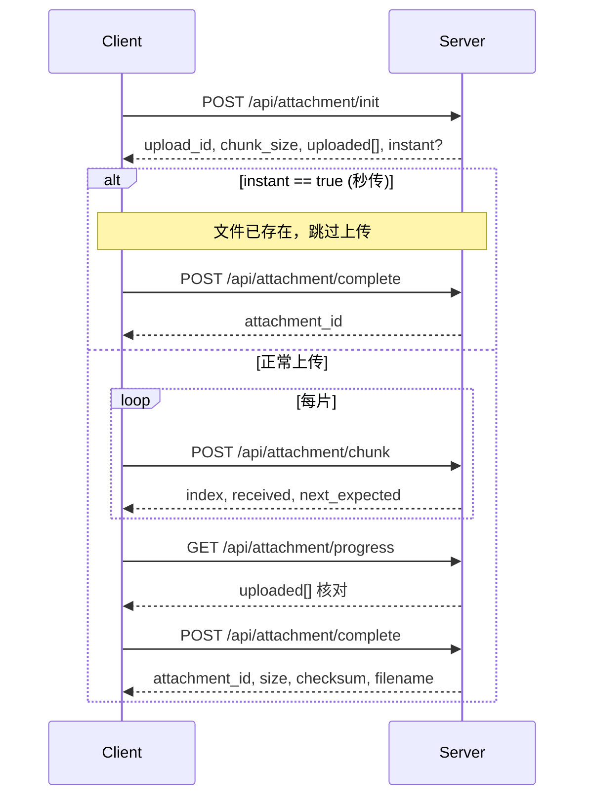

# 邮件服务器 API 文档

## 通用约定

### 基础 URL

```
# 公开接口（无需鉴权）
http://your-domain.com/index.php?ctl={controller}&app={action}

# 业务接口（需鉴权）
http://your-domain.com/api.php?ctl={controller}&app={action}

# 友好 URL（需 mod_rewrite）
http://your-domain.com/api/{controller}/{action}
```

### 统一协议

所有接口返回 JSON，格式如下：

**成功：**

```json
{
    "code": 0,
    "info": { ... }
}
```

**失败：**

```json
{
    "code": <非零业务码>,
    "info": "错误描述"
}
```

> ⚠️ 务必依据 `code` 字段判断成败，不可依赖 HTTP 状态码（失败也返回 200）。

### 认证

- **公开接口**：无需认证，由 `index.php` 入口承载
- **业务接口**：需认证，支持两种方式：
  1. **Token**：`Authorization: Bearer {token}` 请求头，或请求参数 `token={token}`
  2. **Session**：浏览器端自动维持的登录态（PHPSESSID Cookie）

### 分页

带分页的接口接受 `page`（页码，默认 1）和 `page_size`（每页条数，默认 20，上限 100）参数。返回结构：

```json
{
    "page": [ /* 数据行 */ ],
    "total": 128,
    "total_page": 7,
    "current_page": 1,
    "page_size": 20
}
```

---

## 账号认证

### POST /index.php?app=register

注册新用户。

| 参数 | 类型 | 必填 | 说明 |
|------|------|------|------|
| username | string | 是 | 登录用户名 |
| password | string | 是 | 登录密码（6~64 字符） |
| display_name | string | 否 | 显示名称 |

**响应：**

```json
{
    "code": 0,
    "info": {
        "id": 1,
        "email": "username@your-domain.com",
        "display_name": "User Name"
    }
}
```

---

### POST /index.php?app=login

登录，换取 Token。

| 参数 | 类型 | 必填 | 说明 |
|------|------|------|------|
| username | string | 是 | 用户名或完整邮箱地址 |
| password | string | 是 | 密码 |

**响应：**

```json
{
    "code": 0,
    "info": {
        "user": { "id": 1, "email": "...", "display_name": "..." },
        "token": "a1b2c3d4e5f6...",
        "expire_time": "2026-08-12 12:00:00"
    }
}
```

---

### POST /index.php?app=logout

登出，吊销当前 Token。

| 参数 | 类型 | 必填 | 说明 |
|------|------|------|------|
| 无 | | | 通过 Token 或 Session 识别当前用户 |

---

### POST /api.php?app=change_password

修改密码（需鉴权）。

| 参数 | 类型 | 必填 | 说明 |
|------|------|------|------|
| old_password | string | 是 | 当前密码 |
| new_password | string | 是 | 新密码 |

---

### GET /api.php?app=profile

查询个人资料（需鉴权）。

---

## 邮件

### POST /api/mail/send

发送邮件。

| 参数 | 类型 | 必填 | 说明 |
|------|------|------|------|
| to | string | 是 | 收件人，多个用逗号分隔 |
| cc | string | 否 | 抄送 |
| bcc | string | 否 | 密送 |
| subject | string | 否 | 主题 |
| body_text | string | 否 | 纯文本正文 |
| body_html | string | 否 | HTML 正文 |
| attachments | array | 否 | 附件 ID 列表 |
| in_reply_to | string | 否 | 回复的邮件 Message-ID |
| references | string | 否 | 引用链 |

---

### GET /api/mail/list

分页列出邮件摘要（默认收件箱）。

| 参数 | 类型 | 必填 | 说明 |
|------|------|------|------|
| folder_id | int | 否 | 文件夹 ID |
| folder_type | string | 否 | 文件夹类型：inbox / sent / draft / trash / spam |
| page | int | 否 | 页码，1 起 |
| page_size | int | 否 | 每页条数 |

**响应：**每封邮件包含 id、from、subject、summary、mail_time、is_read、is_starred、has_attach 等。

---

### GET /api/mail/get

获取邮件详情（返回完整正文与附件列表）。

| 参数 | 类型 | 必填 | 说明 |
|------|------|------|------|
| id | int | 是 | 邮件 ID |

---

### POST /api/mail/delete

单封删除（移入回收站）。

| 参数 | 类型 | 必填 | 说明 |
|------|------|------|------|
| id | int | 是 | 邮件 ID |

---

### POST /api/mail/purge

彻底删除（回收站中或直接永久删除）。

| 参数 | 类型 | 必填 | 说明 |
|------|------|------|------|
| id | int | 是 | 邮件 ID |

---

### GET /api/mail/status

查询发送投递状态。

| 参数 | 类型 | 必填 | 说明 |
|------|------|------|------|
| id | int | 是 | 邮件 ID |

**响应：**

```json
{
    "code": 0,
    "info": {
        "status": "sent",
        "recipients": [
            { "address": "a@foo.com", "status": "sent" },
            { "address": "b@bar.com", "status": "pending" }
        ]
    }
}
```

---

### POST /api/mail/resend

重投已失败/已发送的邮件（需鉴权，仅限自己的邮件）。

| 参数 | 类型 | 必填 | 说明 |
|------|------|------|------|
| id | int | 是 | 邮件 ID |

---

## 文件夹管理

### GET /api/folder/list

列出全部文件夹（含系统与自建），每条附带邮件总数和未读数。

---

### POST /api/folder/create

创建自建文件夹。

| 参数 | 类型 | 必填 | 说明 |
|------|------|------|------|
| name | string | 是 | 文件夹名称 |

---

### POST /api/folder/rename

重命名自建文件夹（系统文件夹不可重命名）。

| 参数 | 类型 | 必填 | 说明 |
|------|------|------|------|
| id | int | 是 | 文件夹 ID |
| name | string | 是 | 新名称 |

---

### POST /api/folder/remove

删除自建文件夹，其中的邮件自动移入回收站。

| 参数 | 类型 | 必填 | 说明 |
|------|------|------|------|
| id | int | 是 | 文件夹 ID |

---

### POST /api/folder/move

将邮件移动到指定文件夹。

| 参数 | 类型 | 必填 | 说明 |
|------|------|------|------|
| id | int | 是 | 邮件 ID |
| target | int | 是 | 目标文件夹 ID |

---

### POST /api/folder/mark

标记已读 / 未读（支持单个或批量）。

| 参数 | 类型 | 必填 | 说明 |
|------|------|------|------|
| id 或 ids | int/array | 是 | 邮件 ID 或 ID 数组 |
| read | bool | 否 | 标记已读（true，默认）或未读（false） |

---

### POST /api/folder/star

切换星标（已加则取消，未加则加星）。

| 参数 | 类型 | 必填 | 说明 |
|------|------|------|------|
| id | int | 是 | 邮件 ID |

---

### POST /api/folder/batch

批量操作。支持的 action：move、mark_read、mark_unread、star、unstar、delete、permanent_delete。

| 参数 | 类型 | 必填 | 说明 |
|------|------|------|------|
| ids | array/string | 是 | 邮件 ID 列表 |
| action | string | 是 | 操作类型 |
| target | int | action=move 时必需 | 目标文件夹 ID |

---

### GET /api/folder/mails

分页列出某文件夹中的邮件摘要。

| 参数 | 类型 | 必填 | 说明 |
|------|------|------|------|
| folder_id | int | 否 | 文件夹 ID（与 folder_type 二选一） |
| folder_type | string | 否 | 文件夹类型（inbox/sent/draft/trash/spam） |
| page | int | 否 | 页码 |
| page_size | int | 否 | 每页条数 |

---

## 会话

### GET /api/thread/list

分页列出邮件会话，按最后活动时间倒序。

---

### GET /api/thread/detail

获取会话内全部邮件（按时间正序，支持分页）。

| 参数 | 类型 | 必填 | 说明 |
|------|------|------|------|
| id | int | 是 | 会话 ID |
| page | int | 否 | 页码 |
| page_size | int | 否 | 每页条数（默认 50） |

---

## 草稿

### POST /api/thread/draft_save

新建或覆盖保存草稿。

| 参数 | 类型 | 必填 | 说明 |
|------|------|------|------|
| draft_id | int | 否 | 覆盖已有草稿时传入 |
| to | string | 是 | 收件人 |
| cc | string | 否 | 抄送 |
| bcc | string | 否 | 密送 |
| subject | string | 否 | 主题 |
| body_text | string | 否 | 纯文本正文 |
| body_html | string | 否 | HTML 正文 |
| attachments | array | 否 | 附件 ID 列表 |
| in_reply_to | string | 否 | 引用 Message-ID |

---

### GET /api/thread/draft_get

读取草稿详情。

| 参数 | 类型 | 必填 | 说明 |
|------|------|------|------|
| id | int | 是 | 草稿邮件 ID |

---

### POST /api/thread/draft_send

将草稿转为正式发送。

| 参数 | 类型 | 必填 | 说明 |
|------|------|------|------|
| id | int | 是 | 草稿邮件 ID |

---

### POST /api/thread/draft_delete

删除草稿。

| 参数 | 类型 | 必填 | 说明 |
|------|------|------|------|
| id | int | 是 | 草稿邮件 ID |

---

### GET /api/thread/drafts

分页列出所有草稿。

---

## 全文搜索

### GET/POST /api/search/query

多条件全文搜索。

| 参数 | 类型 | 必填 | 说明 |
|------|------|------|------|
| keyword | string | 否 | 检索关键词（主题/发件人/收件人/正文） |
| folder_id | int | 否 | 限定文件夹 |
| folder_type | string | 否 | 文件夹类型（与 folder_id 互斥） |
| start | string | 否 | 起始时间 |
| end | string | 否 | 截止时间 |
| has_attach | int | 否 | 0=不限 1=含附件 -1=无附件 |
| direction | string | 否 | 方向过滤：in（收件）/ out（发件） |
| page | int | 否 | 页码 |
| limit | int | 否 | 每页条数 |

**响应示例：**

```json
{
    "code": 0,
    "info": {
        "list": [ /* 邮件摘要 */ ],
        "total": 42,
        "page": 1,
        "total_page": 3
    }
}
```

---

### GET /api/search/suggest

主题前缀匹配，供自动补全使用。

| 参数 | 类型 | 必填 | 说明 |
|------|------|------|------|
| keyword | string | 是 | 主题前缀 |
| limit | int | 否 | 返回条数（默认 10，上限 30） |

---

## 大附件分片上传

### 分片上传流程



### POST /api/attachment/init

初始化上传会话。

| 参数 | 类型 | 必填 | 说明 |
|------|------|------|------|
| filename | string | 是 | 原始文件名 |
| size | int | 是 | 文件总字节数 |
| chunk_size | int | 是 | 分片大小（字节） |
| checksum | string | 否 | 整文件 SHA256，用于秒传判定 |

**响应示例：**

```json
{
    "code": 0,
    "info": {
        "upload_id": "a1b2c3d4-e5f6-...",
        "chunk_size": 4194304,
        "uploaded": [],
        "instant": false
    }
}
```

`instant: true` 表示秒传命中，可直接调用 complete。

---

### POST /api/attachment/chunk

上传单个分片（multipart/form-data）。

| 参数/字段 | 类型 | 必填 | 说明 |
|-----------|------|------|------|
| upload_id | string | 是 | 上传会话标识 |
| index | int | 是 | 分片序号（0 起始） |
| chunk | file | 是 | 分片文件内容 |


---

### GET /api/attachment/progress

查询上传进度。

| 参数 | 类型 | 必填 | 说明 |
|------|------|------|------|
| upload_id | string | 是 | 上传会话标识 |

**响应示例：**

```json
{
    "code": 0,
    "info": {
        "upload_id": "a1b2c3d4-...",
        "total_chunks": 25,
        "uploaded": [0, 1, 2, 3, 4, 5],
        "percent": 24.0
    }
}
```

---

### POST /api/attachment/complete

合并全部片段，完成上传。

| 参数 | 类型 | 必填 | 说明 |
|------|------|------|------|
| upload_id | string | 是 | 上传会话标识 |

**响应示例：**

```json
{
    "code": 0,
    "info": {
        "attachment_id": 42,
        "size": 104857600,
        "checksum": "abc123...",
        "filename": "report.pdf"
    }
}
```

---

## 附件下载

### GET /api/attachment/download

流式下载附件，支持断点续传（Range 请求）。

| 参数 | 类型 | 必填 | 说明 |
|------|------|------|------|
| id | int | 是 | 附件 ID |

**兼容特性：**

- 客户端发送 `Range: bytes=0-1048575` 时返回 `206 Partial Content`
- 响应头包含 `Content-Range`、`Accept-Ranges: bytes`、`Content-Disposition`
- 下载过程中关闭输出缓冲与脚本超时，大文件不会耗尽内存

---

## 健康检查

### GET /index.php?app=health

探活接口，返回 SMTP 守护进程与发信队列的状态。

**响应示例：**

```json
{
    "code": 0,
    "info": {
        "status": "ok",
        "smtpd": true,
        "sender": true,
        "queue_pending": 3
    }
}
```

---

## 错误码参考

| 错误码 | 含义 |
|--------|------|
| 0 | 成功 |
| 400 | 请求参数错误 |
| 403 | 未登录或 Token 无效 |
| 404 | 资源未找到 |
| 429 | 请求频率超限 |
| 500 | 服务器内部错误 |
| 1001 | 用户名已存在 |
| 1002 | 密码错误 |
| 1003 | 邮箱已满（超出配额） |
| 1004 | 收件人不存在 |
| 1005 | 文件夹名已存在 |
| 1006 | 不可操作系统文件夹 |
| 1007 | 附件大小超限 |
| 1008 | 上传会话已过期 |
| 1009 | 分片序号越界 |
